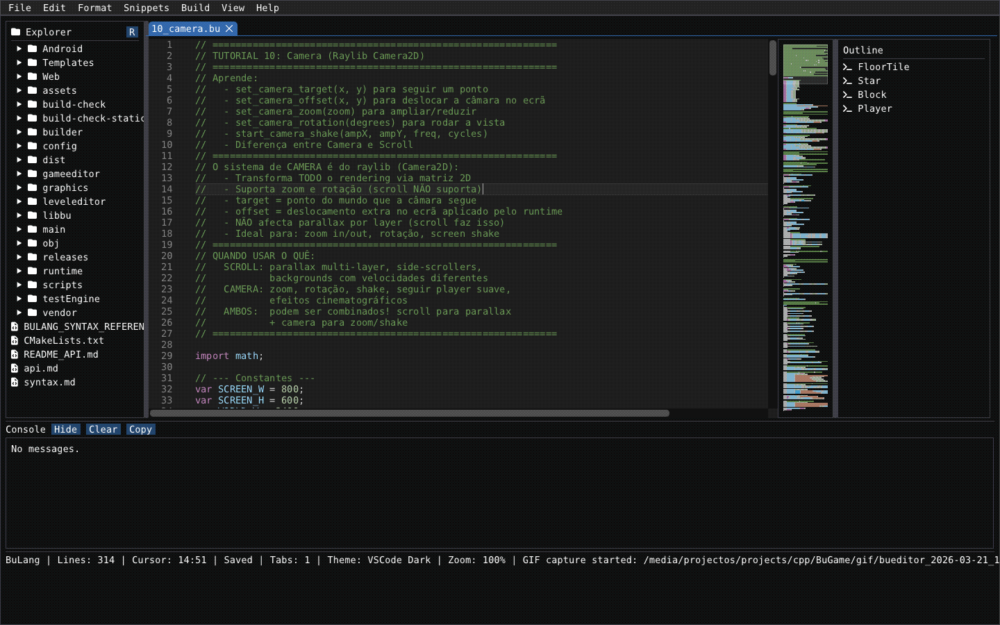
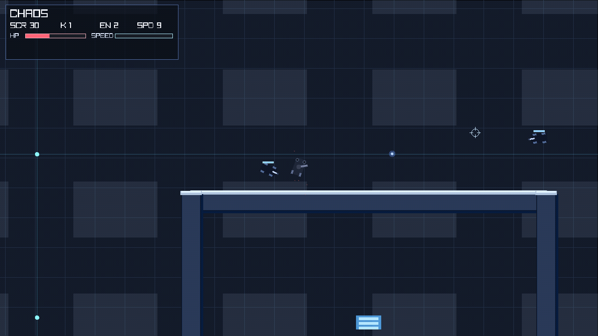
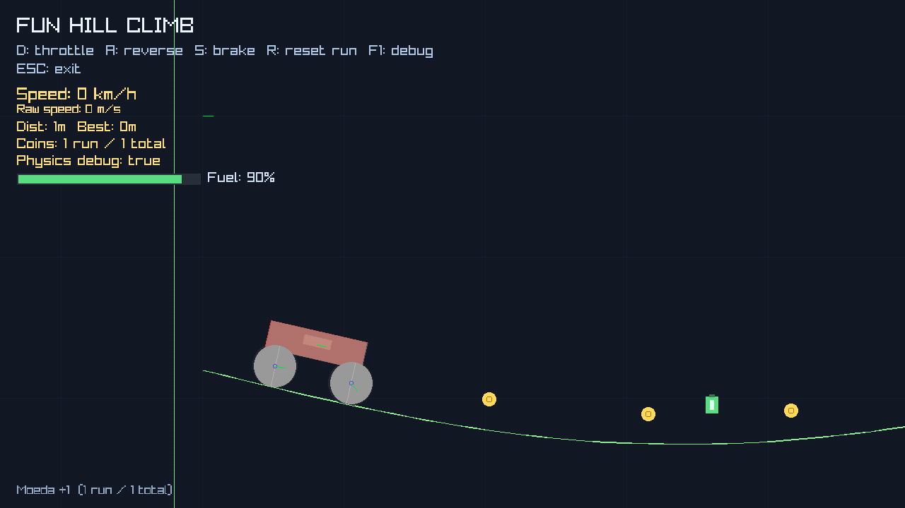
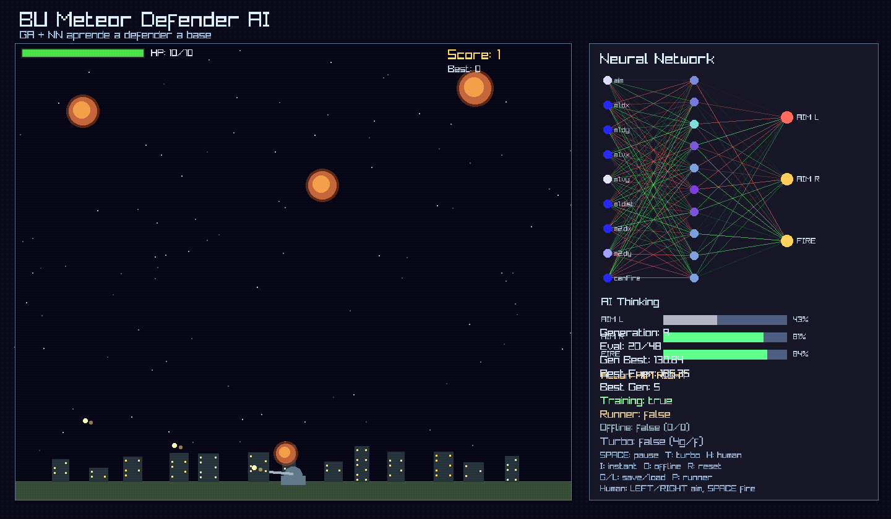
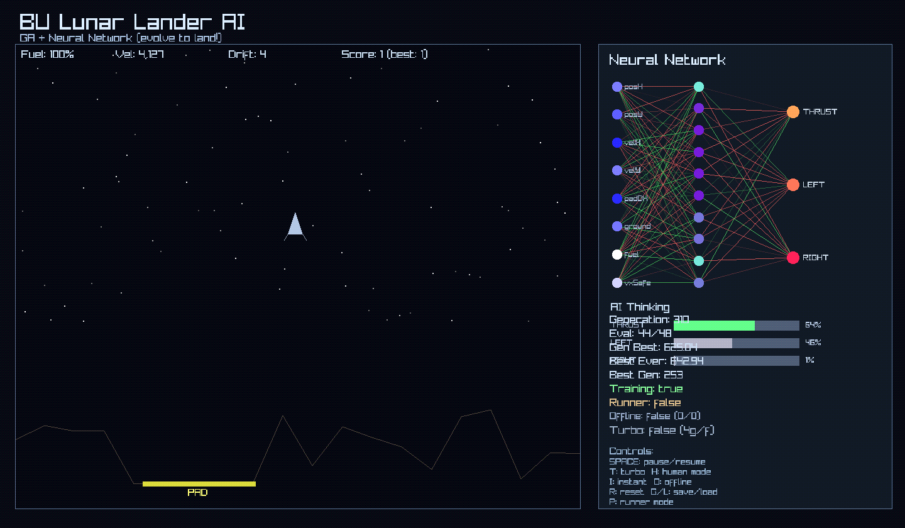
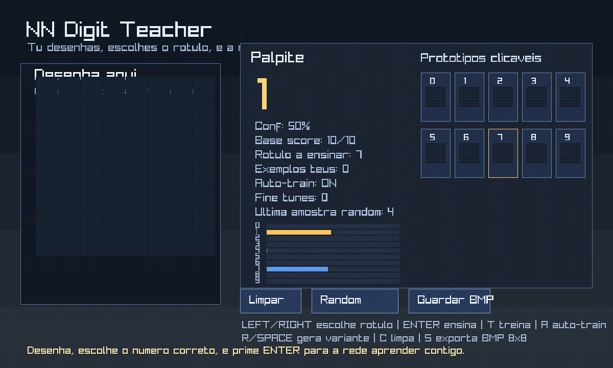
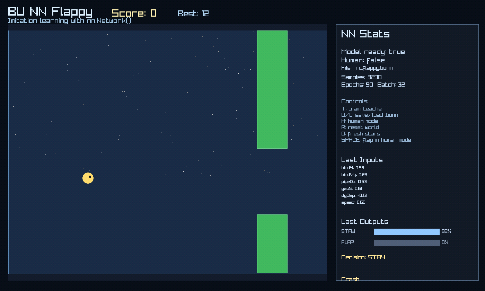
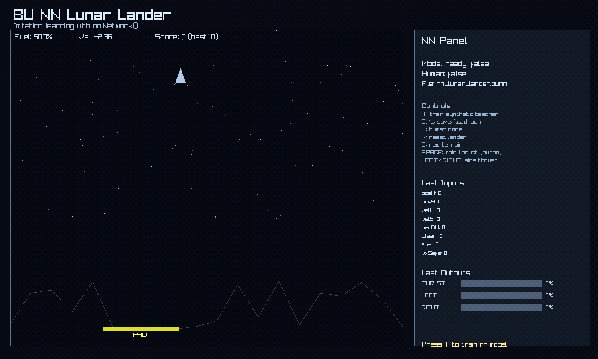

# BUGame

`BUGame` is a C++ workspace for building 2D games. This repository combines several parts in one project:

- a game runtime built on top of `raylib`
- a custom scripting language called `Bu` 
- a VM and bytecode compiler
- a graphical script editor
- a level/scene editor
- a builder for desktop, web, and Android targets

BUGame is strongly inspired by `DIV Games Studio`, especially in its scripting-first workflow and its goal of making 2D game creation fast and approachable.

## Gallery

|           Editor           |          Chaos Demo         |         Box2D Car         |
| :------------------------: | :-------------------------: | :-----------------------: |
|  |  |  |
| Script editing workflow | Arcade gameplay prototype | Vehicle physics demo |

|          AI Defend         |        Neural Net 1        |        Neural Net 2       |
| :------------------------: | :------------------------: | :-----------------------: |
|  |  |  |
| AI gameplay experiment | Neural-network demo | Additional NN experiment |

|         Flappy AI         |      Lunar Lander AI      |        More Soon         |
| :-----------------------: | :-----------------------: | :----------------------: |
|  |  |  |
| Neuroevolution gameplay | AI landing experiment | Add new GIFs here |


## What This Project Is

In practice, BUGame is a small game-development stack where you write 2D game logic in `.bu` scripts, run those scripts inside a C++ runtime, and optionally compile them to `.buc` bytecode.

The core workflow is:

1. Write a game or prototype in `scripts/*.bu`
2. Run it through the runtime
3. Use native bindings for rendering, input, audio, camera, processes, and game logic
4. Optionally compile the script to bytecode and run the bytecode later

The examples in [`scripts/tutorials`](./scripts/tutorials) and [`scripts/releases`](./scripts/releases) show that this repository is not just a rendering library. It is closer to a complete 2D scripting-based game workspace.

## Main Components

### `libbu`

The core language library:

- lexer, parser, and compiler
- VM / interpreter
- bytecode loading
- garbage collector
- standard library and native modules

Key files include [`libbu/src/compiler.cpp`](./libbu/src/compiler.cpp), [`libbu/src/interpreter.cpp`](./libbu/src/interpreter.cpp), and the `builtins_*` sources.

### `graphics`

A 2D engine layer on top of `raylib`:

- scenes and entities
- collision and geometry helpers
- tilemaps
- audio
- particles
- rendering and graphics resource support

### `runtime`

A static library that connects the VM to the game bindings. It reuses most of the code from [`main/src`](./main/src) without the standalone entry point.

### `main`

The main runtime executable. It can:

- run `.bu` source files
- compile source to bytecode with `--compile-bc`
- run bytecode with `--run-bc`

With the current `CMake` setup, this target produces an executable named `main`.

### `gameeditor`

A graphical editor for `.bu` files, with console output, file explorer, minimap, outline, and runtime/compile integration.

Its local preferences are stored in [`config/settings.json`](./config/settings.json).

### `leveleditor`

A visual editor for 2D scenes and objects. The current code indicates support for layers, object placement, editing, and saving `.buscene` files.

### `builder`

A CLI tool for build and release workflows. The current code supports:

- `build`
- `clean`
- `list`
- `serve`
- `release`

It also contains logic for `desktop`, `web`, and `android` outputs.

## Repository Layout

```text
.
|-- libbu/         # language, VM, compiler, builtins
|-- graphics/      # 2D engine and rendering support
|-- runtime/       # reusable runtime library
|-- main/          # main runtime executable
|-- gameeditor/    # script editor
|-- leveleditor/   # level/scene editor
|-- builder/       # build/release tool
|-- scripts/       # examples, tests, tutorials, and games
|-- config/        # local editor configuration
|-- vendor/        # vendored dependencies
`-- Templates/     # export/runtime templates
```

## Technologies and Dependencies

The project includes or directly integrates:

- `raylib`
- `box2d`
- `poly2tri`
- `miniz`
- `imgui`
- `eigen`
- `MiniDNN`
- `nlohmann/json`

Based on the modules present in `libbu`, the language also exposes APIs for files, JSON, regex, networking, time, ZIP archives, cryptography, and some neural-network experiments.

## Build

### Requirements

- a compiler with C++17 support
- `cmake` 3.20 or newer

### Compile

```bash
cmake -S . -B build
cmake --build build -j
```

The main executables are typically written to `bin/`.

## Run

### Run a `.bu` script

```bash
./bin/main scripts/tutorials/01_hello_world.bu
```

### Compile a script to bytecode

```bash
./bin/main --compile-bc scripts/tutorials/01_hello_world.bu build/hello.buc
```

### Run bytecode

```bash
./bin/main --run-bc build/hello.buc
```

If no file is provided, the runtime tries to locate defaults such as `scripts/main.bu` or `scripts/main.buc`.

## What You Will Find in `scripts/`

The [`scripts`](./scripts) folder is the most practical reference for understanding the project. It contains:

- introductory tutorials
- isolated feature tests
- graphics and audio demos
- AI / neural-network experiments
- small games and packaged releases

Good starting points:

- [`scripts/tutorials/01_hello_world.bu`](./scripts/tutorials/01_hello_world.bu)
- [`scripts/tutorials/03_processes.bu`](./scripts/tutorials/03_processes.bu)
- [`scripts/tutorials/08_mini_game.bu`](./scripts/tutorials/08_mini_game.bu)

The safest short description is:

> BUGame is a 2D game-development environment in C++ with its own scripting language, runtime, editor, and build tools.

## Related Documentation

- [`api.md`](./api.md)
- [`README_API.md`](./README_API.md)
- [`syntax.md`](./syntax.md)
- [`BULANG_SYNTAX_REFERENCE.md`](./BULANG_SYNTAX_REFERENCE.md)

## One-Line Summary

> BUGame is a 2D C++ game/workspace stack with a custom scripting language (`Bu` / `BuGL`) for building and running scripted games, plus an editor, level editor, and build pipeline.
